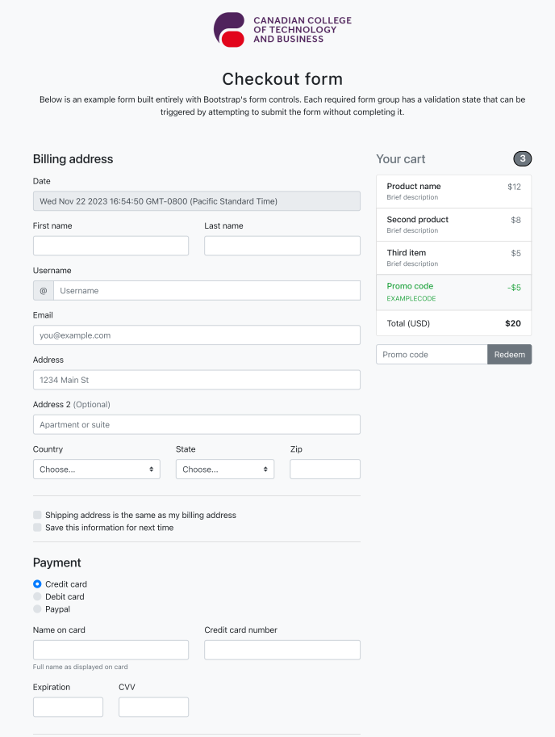

# Bonus Lab

In this additional lab we are requested to create 1 HTML web file + 1 CSS style file to design a web page similar (at lease 90% similarity) to the PDF file. Also, you should work with GitHub with at least 3 branches (Main, Development, Feature1_YOUR_NAME).

